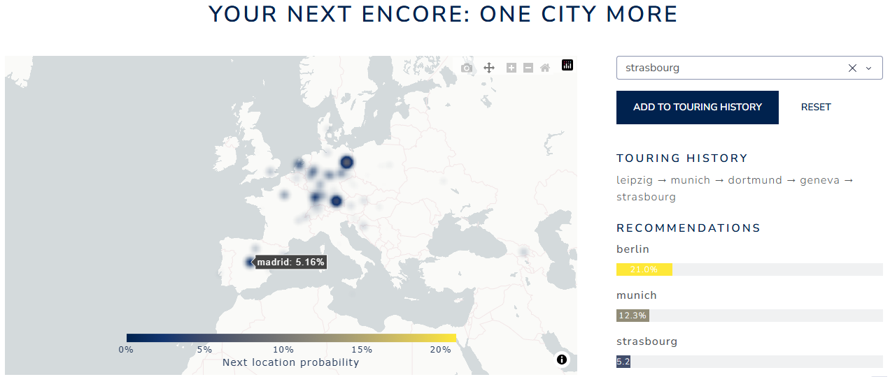

# NextLoc-dashboard
Dashboard to inform next touring location for electronic music artists (from NextLoc GRU)

## Install
run : pip install -r requirements.txt

## Run
run : python NextLoc-dashboard.py
open in browser : http://127.0.0.1:8050

## Model documentation
Gated Reccurent Unit Neural Network trained on 2.5M+ clubbing events in 560+ cities, from Resident Advisor
